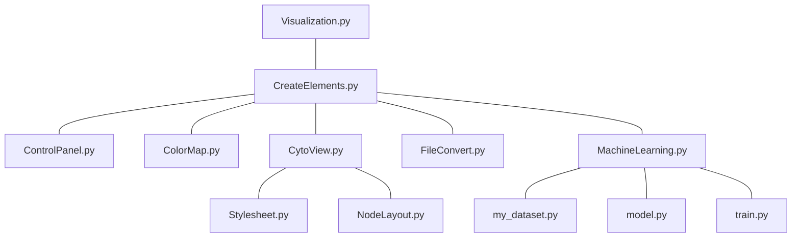

# Visualization
* Home page before loading of data


* Home page after loading of data


* Home page after loading of data and activation of learn graph node classification option


* Visualization page after loading of data


* Visualization page after loading of data with clicked node


Here we can see that the CytoView is delimited by the red rectangle excepted the two buttons *Reset view* and *Reset stylesheet* 

Also the ControlPanel is delimited by the blue rectangle.
## File Tree Structure

    ├── Visualization                    
    │   ├── ColorMap.py             # Part repsonsible to create adequate color mapping for nodes and edges legend
    │   ├── ControlPanel.py         # Part design to control the creation of the legend and export navigation bar with cytoscape layout
    │   ├── CreateElements.py       # Create the different pages (home and visualization) 
    │   ├── CytoView.py             # Create and update the graph interactive part
    │   ├── NodeLayout.py           # Define the position and size of nodes reagrding to their degree and initial given position
    │   ├── Stylesheet.py           # Register all the possible stylesheet for nodes and edges regarding their state
    │   ├── Visualization.py        # Define the server and theme use for all the pages
    │   ├── FileConvert.py          # Convert the csv/xls or gml file into dataframe and dcc.store objects
    │   ├── ML_scripts
    │   │   ├── MachineLearning.py  # Create a class that is launching the creation of the dataset, train the model and give the results on test set for the graph to be shown properly
    │   │   ├── my_dataset.py       # Creation of a pytorch geometric dataset from the data saved in dcc.Store objects
    │   │   ├── train.py            # 
    │   │   ├── model.py            #
    │   ├── Config
    │   │   ├── ConfigExplicit.txt          # Config with explicit ref to weblinks
    │   │   ├── Config.yml
    │   ├── assets
    │   │   ├── favicon.ico       
    │   │   ├── reset.css 
    ├── Dockerfile                 
    ├── Test_CSV.py                 # File able to create fake examples for testing
    └── README.md

## Files dependencies


# Instalation process
I manually changed one file to be able to control wheel sensitivity the process is described there (https://github.com/plotly/dash-cytoscape/compare/wheel-sensitivity-feature)

# Docker
With gpu
```
  docker build -t visualization-no-cuda -f dockerfileCuda .
  docker run -p 8050:8050 --rm visualization-cuda
```
Without gpu
```
  docker build -t visualization-no-cuda -f dockerfileNoCuda .
  docker run -p 8050:8050 --rm visualization-no-cuda
```
## Input files format
They are as follow :

* **CSV and XLS files** (example with cora file)

    * File for edges should have the same header as shown below and registered as csv/xls. You are force to furnish values for the **source** and **target** you can also provide values for **class** and **data** but it is not mandatory and sparse information could be given. A solution could be to add nothing, just let it empty (as shown below).
    ```
    target,source,class
    35,1033,cites
    35,103482,cites
    35,103515,
    35,1050679,cites
    ...
    ```

    * File for nodes should have the same header as shown below and registered as csv/xls.You are force to furnish values for the **id** you can also provide values for **positionX**,**positionY**,**feature**, **class** and **data**. <A solution could be to add nothing, just let it empty (as shown below).>
    ```
    feature,class,id,positionX,positionY
    "[0,..., 1, 0, 0, 0, 0, 0, 0]",Neural_Networks,31336,-6.7792907,-3.7140813
    "[0,..., 0, 0, 0, 0, 0, 0, 0]",Rule_Learning,1061127,-1.8820779,6.1064944
    "[0,..., 0, 0, 0, 0, 0, 0, 0]",Reinforcement_Learning,1106406,2.2292302,2.7001865
    "[0,..., 0, 0, 0, 0, 0, 0, 0]",Reinforcement_Learning,13195,1.684225,-0.4627512
    ...
    ```

* **GML Files**
  File should have the same form as shown below and registered as gml. You are force to furnish values for the **source** and **target** for the edges and **id**,**positionX**,**positionY** for the nodes, you can also provide values for **class** and **data** but it is not mandatory and sparse information could be given. A solution could be to add **'NaN'**
    ```
    graph [
  multigraph 1
  node [
    id 0
    label "0"
    positionX -91.13624117479557
    positionY -66.76717678700189
    class "child"
    data "Name : fabrice, age : 22"
  ]
  node [
    id 1
    label "1"
    positionX -46.73841145000086
    positionY 98.31243547492073
    class "nan"
    data "Name : fabrice, age : 55"
  ]
  node [
    id 2
    label "2"
    positionX 35.17666039345673
    positionY 10.373519892509364
    class "child"
    data "Name : matthieu, age : 22"
  ]
  node [
    id 3
    label "3"
    positionX 8.934336460157127
    positionY -90.02082919747694
    class "child"
    data "nan"
  ]
  node [
    id 4
    label "4"
    positionX -8.449593591524106
    positionY -46.77166171108491
    class "child"
    data "Name : madeleine, age : 65"
  ]
  node [
    id 5
    label "5"
    positionX 70.49398332611486
    positionY 80.29494707270953
    class "nan"
    data "nan"
  ]
  node [
    id 6
    label "6"
    positionX 54.341204747486245
    positionY 13.288421419471064
    class "child"
    data "Name : matthieu, age : 65"
  ]

  ...

  edge [
    source 0
    target 2
    key 0
    class "professional"
    data "Knowing since : 23 years"
  ]
  edge [
    source 0
    target 2
    key 1
    class "professional"
    data "Knowing since : 23 years"
  ]
  edge [
    source 0
    target 11
    key 0
    class "nan"
    data "Knowing since : 9 years"
  ]
  edge [
    source 0
    target 11
    key 1
    class "friend"
    data "Knowing since : 9 years"
  ]
  edge [
    source 0
    target 6
    key 0
    class "family"
    data "Knowing since : 9 years"
  ]
  edge [
    source 0
    target 10
    key 0
    class "family"
    data "Knowing since : 9 years"
  ]
  ...
  ]
    ```
## Usage of each keyword
* **Data** is a string that is only used to display information about the nodes or edges when clicked on.
* **Class** is a string and correspond to the class of each node/edge

  * For an edge:
    * **Key** are auto generated in gml files and not used in my program
    * **Source** the beginning node of the link (this is important if you have a directed graph and want to activate the directed graph button that will allow you to see which is incoming our outcoming when clicked on one)
    * **Target** the end node of the link (this is important if you have a directed graph and want to activate the directed graph button that will allow you to see which is incoming our outcoming when clicked on one)
  
  * For a node:
    * **id** is the identifier of the node
    * **positionX** is the position of the node along x axis
    * **positionY** is the position of the node along y axis
    * **feature** is a numeric vectorized representation of the attribute of the node pre computed by the user (this will be used to train the model, if the option is choosed, and make some prediction on node classification)
    


### Color Map file
Here you can change the colormap for nodes and edges. The default color when there is too much classes is grey with #999999


