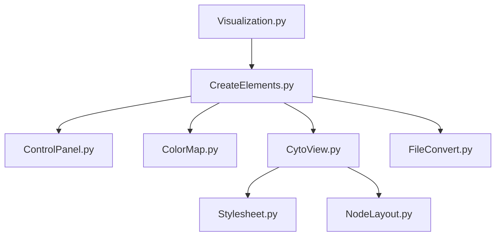

# Visualization
* Page d'accueil avant le chargement des données


* Page après le chargement des fichiers


* Page de visualisation


Here we can see that the CytoView is delimited by the red rectangle excepted the two buttons *Reset view* and *Reset stylesheet* 

Also the ControlPanel is delimited by the blue rectangle.
## File Tree Structure

    ├── Visualization                    
    │   ├── ColorMap.py           # Part repsonsible to create adequate color mapping for nodes and edges legend
    │   ├── ControlPanel.py       # Part design to control the creation of the legend and export navigation bar with cytoscape layout
    │   ├── CreateElements.py     # Create the different pages (home and visualization) 
    │   ├── CytoView.py           # Create and update the graph interactive part
    │   ├── NodeLayout.py         # Define the position and size of nodes reagrding to their degree and initial given position
    │   ├── Stylesheet.py         # Register all the possible stylesheet for nodes and edges regarding their state
    │   ├── Visualization.py      # Define the server and theme use for all the pages
    │   ├── assets
    │   │   ├── favicon.ico       
    │   │   ├── reset.css  
    └── README.md
## Input files format
They are as follow :

* CSV and XLS files 

    * File for edges should have the same header as shown below and registered as csv/xls. You are force to furnish values for the **source** and **target** you can also provide values for **type** and **data** but it is not mandatory and sparse information could be given. A solution could be to add nothing, just let it empty (as shown below).
    ```
    source,target,type,data
    16,15,friend,Knowing since : 68 years
    5,2,friend,
    11,17,professional,Knowing since : 2 years
    18,8,friend,Knowing since : 97 years
    13,5,,Knowing since : 2 years
    8,18,friend,Knowing since : 35 years
    0,2,professional,Knowing since : 23 years
    9,6,family,Knowing since : 9 years
    6,12,,Knowing since : 9 years
    1,15,professional,Knowing since : 68 years
    16,9,professional,Knowing since : 3 years
    11,4,professional,Knowing since : 68 years
    19,13,professional,
    ...
    ```

    * File for nodes should have the same header as shown below and registered as csv/xls.
    You are force to furnish values for the **id**,**positionX**,**positionY** you can also provide values for **type** and **data** but it is not mandatory and sparse information could be given. A solution could be to add nothing, just let it empty (as shown below).
    ```
    id,positionX,positionY,type,data
    0,-91.13624117479557,-66.76717678700189,child,"Name : fabrice, age : 22"
    1,-46.73841145000086,98.31243547492073,,
    2,35.17666039345673,10.373519892509364,child,"Name : matthieu, age : 22"
    3,8.934336460157127,-90.02082919747694,,"Name : fabrice, age : 48"
    4,-8.449593591524106,-46.77166171108491,child,"Name : madeleine, age : 65"
    5,70.49398332611486,80.29494707270953,adult,"Name : fabrice, age : 65"
    6,54.341204747486245,13.288421419471064,child,
    7,55.67321134000403,-40.89296087725318,child,"Name : madeleine, age : 48"
    8,-43.595013960941785,-11.608992182740579,adult,"Name : fabrice, age : 34"
    ...
    ```
## Files dependencies


### Color Map file
Here you can change the colormap for nodes and edges. The default color when there is too much classes is grey with #999999


