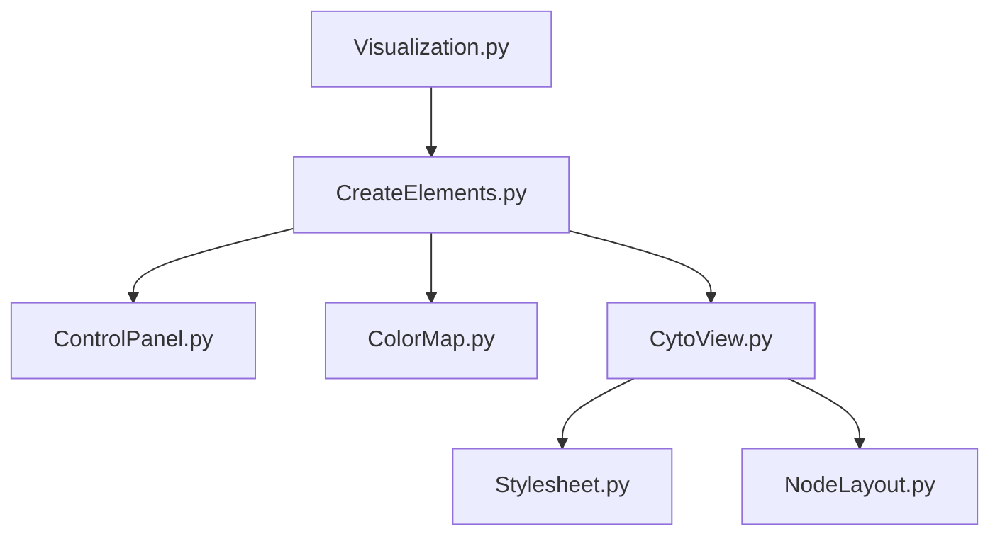

# Visualization
* Page d'accueil avant le chargement des données


* Page après le chargement des fichiers


* Page de visualisation


Here we can see that the CytoView is delimited by the red rectangle excepted the two buttons *Reset view* and *Reset stylesheet* 

Also the ControlPanel is delimited by the blue rectangle.
## File Tree Structure

    ├── Visualization                    
    │   ├── ColorMap.py           # Part repsonsible to create adequate color mapping for nodes and edges legend
    │   ├── ControlPanel.py       # Part design to control the creation of the legend and export navigation bar with cytoscape layout
    │   ├── CreateElements.py     # Create the different pages (home and visualization) 
    │   ├── CytoView.py           # Create and update the graph interactive part
    │   ├── NodeLayout.py         # Define the position and size of nodes reagrding to their degree and initial given position
    │   ├── Stylesheet.py         # Register all the possible stylesheet for nodes and edges regarding their state
    │   ├── Visualization.py      # Define the server and theme use for all the pages
    │   ├── assets
    │   │   ├── favicon.ico       
    │   │   ├── reset.css  
    └── README.md
## Input files format
They are as follow :

* **Edges file** should contain in its name **Edges** or **Links**. File for edges should also have the same header and registered as csv
```
source,target,type,data
0,1
2,3
4,5
6,7
8,9
10,11
...
```

* **Node file** should contain in its name **Nodes**. File for nodes should also have the same header and registered as csv
```
node,positionX,positionY,type,data
0,-43.38563,-41.991077,2
1,-20.32137,-53.12107,2
2,-41.036217,-42.4627,2
3,-6.8819265,-63.507526,2
4,21.066505,-51.567326,2
5,-43.997192,-29.982145,2
6,-1.9271212,-3.9017417,2
7,1.7222745,-20.133389,2
...
```
## Files dependencies


### Color Map file
Here you can change the colormap for nodes and edges. The default color when there is too much classes is grey with #999999


