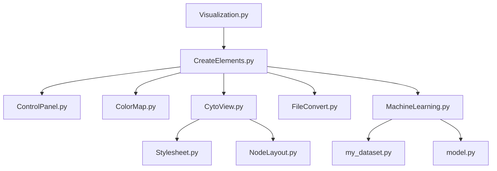

# Visualization
* Page d'accueil avant le chargement des données


* Page après le chargement des fichiers


* Page de visualisation


Here we can see that the CytoView is delimited by the red rectangle excepted the two buttons *Reset view* and *Reset stylesheet* 

Also the ControlPanel is delimited by the blue rectangle.
## File Tree Structure

    ├── Visualization                    
    │   ├── ColorMap.py             # Part repsonsible to create adequate color mapping for nodes and edges legend
    │   ├── ControlPanel.py         # Part design to control the creation of the legend and export navigation bar with cytoscape layout
    │   ├── CreateElements.py       # Create the different pages (home and visualization) 
    │   ├── CytoView.py             # Create and update the graph interactive part
    │   ├── NodeLayout.py           # Define the position and size of nodes reagrding to their degree and initial given position
    │   ├── Stylesheet.py           # Register all the possible stylesheet for nodes and edges regarding their state
    │   ├── Visualization.py        # Define the server and theme use for all the pages
    │   ├── FileConvert.py          # Convert the csv/xls or gml file into dataframe and dcc.store objects
    │   ├── ML_scripts
    │   │   ├── MachineLearning.py  # Create a class that is launching the creation of the dataset, train the model and give the results on test set for the graph to be shown properly
    │   │   ├── my_dataset.py       # Creation of a pytorch geometric dataset from the data saved in dcc.Store objects
    │   │   ├── train.py            # 
    │   │   ├── model.py            #
    │   ├── assets
    │   │   ├── favicon.ico       
    │   │   ├── reset.css  
    └── README.md

# Instalation process
I manually changed one file to be able to control wheel sensitivity the process is described there (https://github.com/plotly/dash-cytoscape/compare/wheel-sensitivity-feature)
## Input files format
They are as follow :

* **CSV and XLS files**

    * File for edges should have the same header as shown below and registered as csv/xls. You are force to furnish values for the **source** and **target** you can also provide values for **class** and **data** but it is not mandatory and sparse information could be given. A solution could be to add nothing, just let it empty (as shown below).
    ```
    source,target,class,data
    16,15,friend,Knowing since : 68 years
    5,2,friend,
    11,17,professional,Knowing since : 2 years
    18,8,friend,Knowing since : 97 years
    13,5,,Knowing since : 2 years
    8,18,friend,Knowing since : 35 years
    0,2,professional,Knowing since : 23 years
    9,6,family,Knowing since : 9 years
    6,12,,Knowing since : 9 years
    1,15,professional,Knowing since : 68 years
    16,9,professional,Knowing since : 3 years
    11,4,professional,Knowing since : 68 years
    19,13,professional,
    ...
    ```

    * File for nodes should have the same header as shown below and registered as csv/xls.You are force to furnish values for the **id**,**positionX**,**positionY** you can also provide values for **class** and **data** but it is not mandatory and sparse information could be given. A solution could be to add nothing, just let it empty (as shown below).
    ```
    id,positionX,positionY,class,data
    0,-91.13624117479557,-66.76717678700189,child,"Name : fabrice, age : 22"
    1,-46.73841145000086,98.31243547492073,,
    2,35.17666039345673,10.373519892509364,child,"Name : matthieu, age : 22"
    3,8.934336460157127,-90.02082919747694,,"Name : fabrice, age : 48"
    4,-8.449593591524106,-46.77166171108491,child,"Name : madeleine, age : 65"
    5,70.49398332611486,80.29494707270953,adult,"Name : fabrice, age : 65"
    6,54.341204747486245,13.288421419471064,child,
    7,55.67321134000403,-40.89296087725318,child,"Name : madeleine, age : 48"
    8,-43.595013960941785,-11.608992182740579,adult,"Name : fabrice, age : 34"
    ...
    ```

* **GML Files**
  File should have the same form as shown below and registered as gml. You are force to furnish values for the **source** and **target** for the edges and **id**,**positionX**,**positionY** for the nodes, you can also provide values for **class** and **data** but it is not mandatory and sparse information could be given. A solution could be to add **'NaN'**
    ```
    graph [
  multigraph 1
  node [
    id 0
    label "0"
    positionX -91.13624117479557
    positionY -66.76717678700189
    class "child"
    data "Name : fabrice, age : 22"
  ]
  node [
    id 1
    label "1"
    positionX -46.73841145000086
    positionY 98.31243547492073
    class "nan"
    data "Name : fabrice, age : 55"
  ]
  node [
    id 2
    label "2"
    positionX 35.17666039345673
    positionY 10.373519892509364
    class "child"
    data "Name : matthieu, age : 22"
  ]
  node [
    id 3
    label "3"
    positionX 8.934336460157127
    positionY -90.02082919747694
    class "child"
    data "nan"
  ]
  node [
    id 4
    label "4"
    positionX -8.449593591524106
    positionY -46.77166171108491
    class "child"
    data "Name : madeleine, age : 65"
  ]
  node [
    id 5
    label "5"
    positionX 70.49398332611486
    positionY 80.29494707270953
    class "nan"
    data "nan"
  ]
  node [
    id 6
    label "6"
    positionX 54.341204747486245
    positionY 13.288421419471064
    class "child"
    data "Name : matthieu, age : 65"
  ]

  ...

  edge [
    source 0
    target 2
    key 0
    class "professional"
    data "Knowing since : 23 years"
  ]
  edge [
    source 0
    target 2
    key 1
    class "professional"
    data "Knowing since : 23 years"
  ]
  edge [
    source 0
    target 11
    key 0
    class "nan"
    data "Knowing since : 9 years"
  ]
  edge [
    source 0
    target 11
    key 1
    class "friend"
    data "Knowing since : 9 years"
  ]
  edge [
    source 0
    target 6
    key 0
    class "family"
    data "Knowing since : 9 years"
  ]
  edge [
    source 0
    target 10
    key 0
    class "family"
    data "Knowing since : 9 years"
  ]
  ...
  ]
    ```
## Usage of each keyword
* **Data** is a string that is only used to display information about the nodes or edges when clicked on.
* **Class** is a string and correspond to the class of each node/edge

  * For an edge:
    * **Key** are auto generated in gml files and not used in my program
    * **Source** the beginning node of the link
    * **Target** the end node of the link
  
  * For a node:
    * **id** is the identifier of the node
    * **positionX** is the position of the node along x axis
    * **positionY** is the position of the node along y axis
    * **feature** is a numeric vectorized representation of the attribute of the node pre computed by the user (this will be used to train the model, if the option is choosed, and make some prediction on node classification)
    
## Files dependencies


### Color Map file
Here you can change the colormap for nodes and edges. The default color when there is too much classes is grey with #999999


